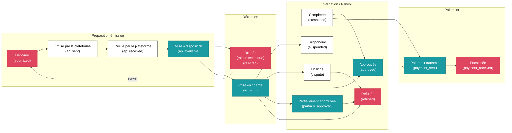
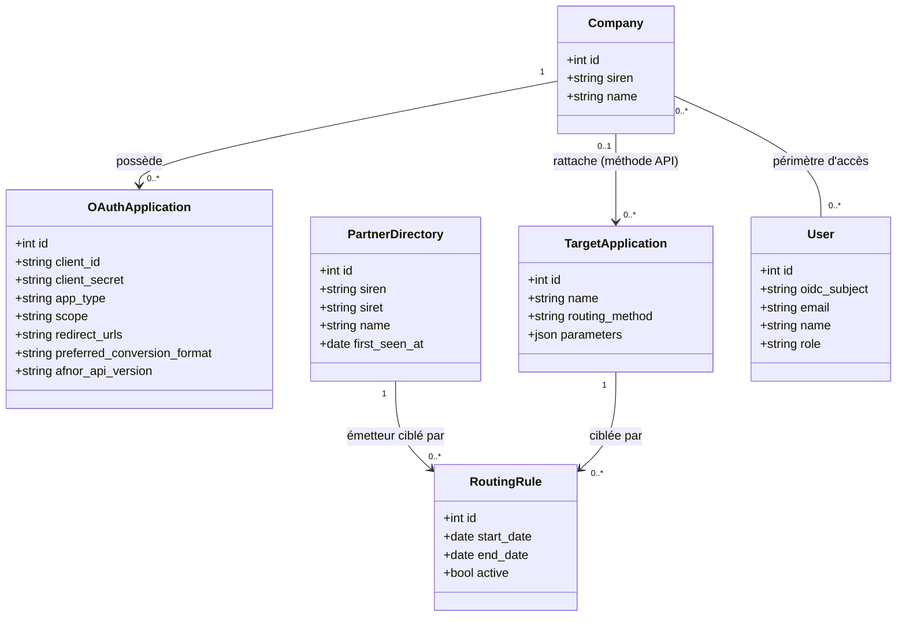
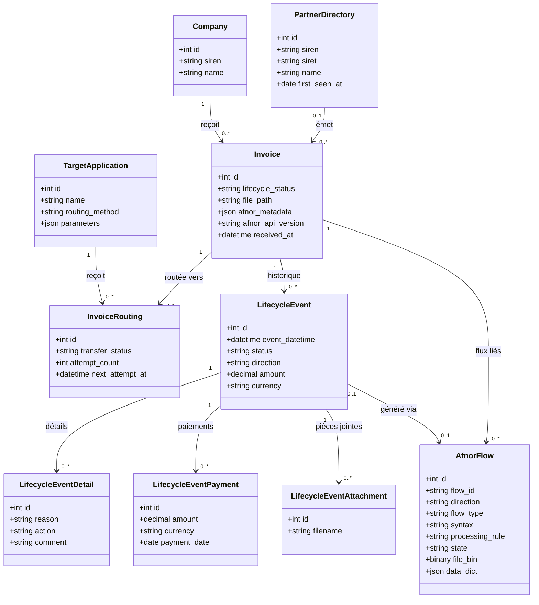
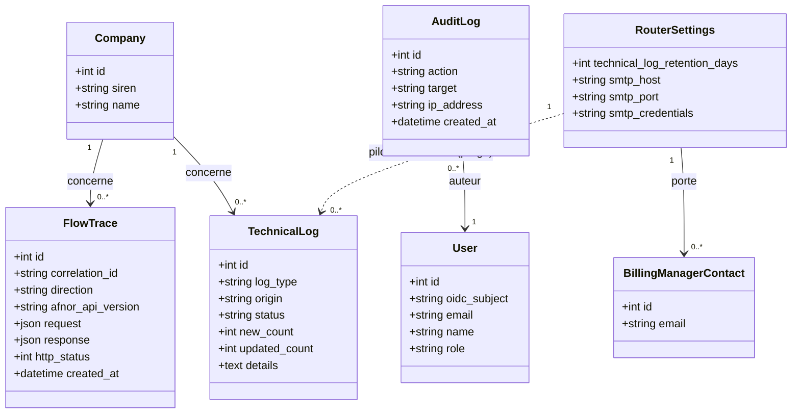
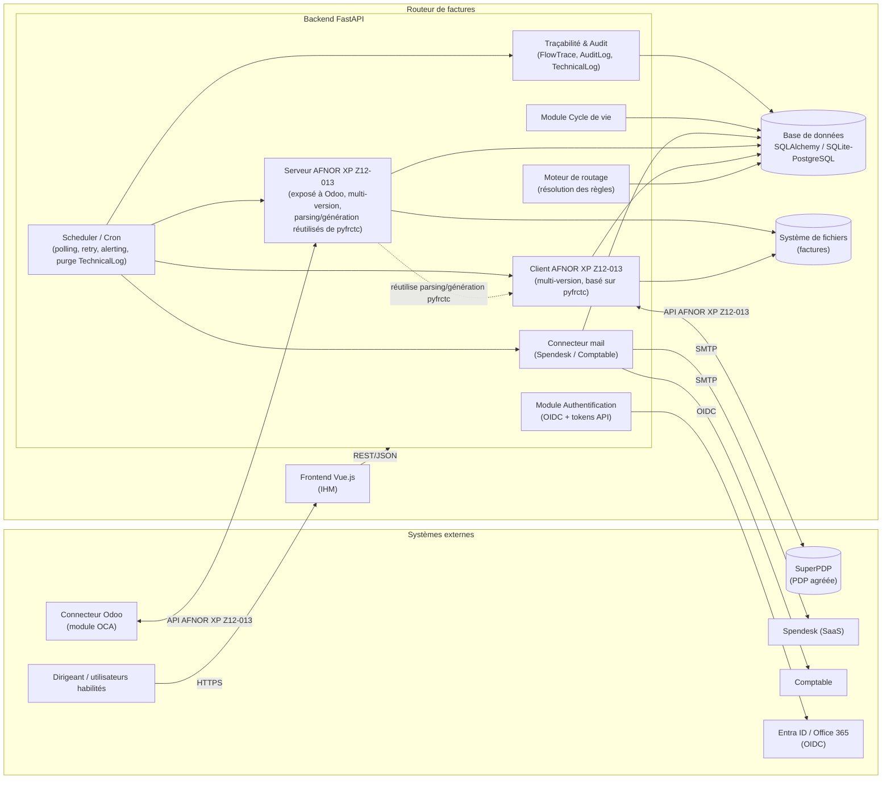

# Spécification — Routeur de factures électroniques

## 1. Contexte et objectifs

### La réforme de la facturation électronique en France

La réforme française de la facturation électronique impose progressivement à toutes les entreprises assujetties à la TVA :

- de **recevoir** leurs factures fournisseurs au format électronique, quelle que soit leur taille, dès l'entrée en vigueur de l'obligation ;
- d'**émettre** leurs factures clients au format électronique pour leurs opérations B2B domestiques (entre entreprises assujetties en France) ;
- de transmettre du **e-reporting** (données de transaction et, le cas échéant, de paiement) à l'administration fiscale pour les opérations hors du champ de la facturation électronique obligatoire (ventes aux particuliers B2C, opérations internationales) ;
- le tout via des **plateformes de dématérialisation partenaires (PDP)** agréées, interconnectées entre elles et avec l'annuaire central de facturation électronique (et Peppol).

Au-delà du simple envoi/réception de la facture, la réforme impose également le suivi d'un **cycle de vie normalisé** : chaque étape du traitement d'une facture (dépôt, mise à disposition, prise en charge, approbation, litige, paiement…) doit être transmise sous forme de statuts normalisés entre la plateforme du vendeur et celle de l'acheteur, afin que l'administration fiscale dispose d'une vision fiable de l'état réel de chaque facture à des fins de contrôle de la TVA. Le schéma suivant illustre ce cycle de vie standard (statuts **obligatoires** en rouge, **recommandés** en bleu-vert, **autres** en blanc) ; les clés techniques entre parenthèses sont celles utilisées dans le catalogue de statuts détaillé au § 4.2 :



C'est ce cycle de vie — repris intégralement, avec l'ensemble de ses statuts (y compris ceux non représentés dans ce schéma simplifié : `stamped`, `cancelled`, `routing_error`, `direct_payment_query`, `factored`, `undisclosed_factored`, `payment_entity_change`, `not_factored`, `unacceptable`) et mappé aux codes techniques de la norme AFNOR XP Z12-013 — que le routeur doit permettre de consulter et, pour le sous-ensemble saisissable manuellement, de générer (§ 4.2).

### Le besoin du Dirigeant

L'utilisateur (le "Dirigeant") dirige deux entreprises françaises assujetties à la TVA. À ce titre, il doit recevoir et émettre des factures électroniques, ainsi que produire du e-reporting selon la nature des opérations.

Les deux entreprises s'appuient sur une plateforme de dématérialisation partenaire (PDP) agréée, **SuperPDP** (https://www.superpdp.tech/), qui envoie et reçoit les factures pour leur compte.

En aval de SuperPDP, trois canaux de gestion traitent les factures :

1. **Spendesk** (SaaS) : circuit de validation des factures fournisseurs et génération du fichier de virement SEPA.
2. **Odoo** (instance on-premise, open source, modules communautaires OCA) :
   - **A.** émission des factures vers les clients assujettis à la TVA en France ;
   - **B.** émission du e-reporting pour les ventes vers des clients non assujettis (particuliers, entreprises étrangères) ;
   - **C.** conservation d'une copie des factures de sous-traitants (uniquement), rattachées aux projets, pour fiabiliser le P&L des projets.
3. **Le comptable** : certaines factures lui sont transmises directement.

### Problème à résoudre

Le routage entre SuperPDP et ces trois canaux doit s'effectuer selon le **SIREN/SIRET de l'émetteur** de la facture reçue. Or :

- SuperPDP ne permet pas de routage dynamique selon le SIREN/SIRET de l'émetteur.
- Les deux entreprises ne disposent que d'une seule adresse de facturation dans l'annuaire de facturation électronique (et dans l'annuaire Peppol) : leur **SIREN respectif**. Aucune adresse plus fine (SIRET, SIRET+suffixe) ne doit être créée, afin :
  - d'éviter que les fournisseurs se trompent d'adresse ;
  - de pouvoir faire évoluer les règles de routage internes sans avoir à notifier les fournisseurs/clients d'un changement d'adresse.

### Solution

Développer un **routeur de factures** qui :
- s'interface avec SuperPDP via l'API normalisée **AFNOR XP Z12-013** pour récupérer et stocker les factures reçues ;
- expose une IHM d'administration et de consultation ;
- expose lui-même une API conforme à la norme **AFNOR XP Z12-013** pour permettre à Odoo de consommer les factures qui lui sont destinées ;
- route les factures vers Spendesk par envoi d'email ;
- est conçu de façon générique pour accueillir de nouveaux canaux/mécanismes de routage à l'avenir.

## 2. Acteurs et systèmes

| Acteur / Système | Rôle |
|---|---|
| Dirigeant / Administrateur | Configure les règles de routage, consulte les factures, gère les accès |
| Comptable / utilisateurs habilités | Consultent les factures dans leur périmètre |
| SuperPDP | PDP agréée ; source des factures entrantes, cible des factures/e-reporting sortants |
| Routeur (objet de cette spec) | Récupère, stocke, route, expose les factures |
| Odoo (via connecteur/module OCA) | Consomme l'API AFNOR exposée par le routeur ; émet factures et e-reporting via le routeur |
| Spendesk | Reçoit les factures par email |
| Comptable (canal direct) | Reçoit certaines factures par email (cf. § 4.6) |

## 3. Vue d'ensemble des flux

```
Fournisseurs ──► SuperPDP ──(API AFNOR XP Z12-013)──► Routeur ──┬─► Odoo (API AFNOR XP Z12-013, tiré par Odoo)
                                                                  ├─► Spendesk (email)
                                                                  └─► Comptable (email)

Odoo ──(API AFNOR XP Z12-013, émission facture/e-reporting)──► Routeur ──(proxy)──► SuperPDP
```

Le routeur joue donc un double rôle vis-à-vis de la norme AFNOR XP Z12-013 :
- **client** de l'API exposée par SuperPDP (récupération des factures entrantes) ;
- **serveur** de la même API à destination d'Odoo (mise à disposition des factures sortantes pour Odoo, et proxy transparent pour les envois de facture/e-reporting initiés par Odoo).

## 4. Exigences fonctionnelles

### 4.1 Récupération et stockage des factures reçues

- Le routeur se connecte à l'API AFNOR XP Z12-013 exposée par SuperPDP (Swagger/documentation : https://www.superpdp.tech/documentation/9) pour récupérer toutes les factures reçues, pour chacune des deux entreprises gérées.
- Chaque facture récupérée est stockée :
  - le **fichier** de la facture sur le système de fichiers ;
  - les **métadonnées** (dont le chemin du fichier) indexées en base de données.
- **Mode de récupération** : à ce jour, SuperPDP n'expose pas de mécanisme de notification (webhook) — le routeur interroge donc l'API en **polling toutes les 5 minutes**. SuperPDP a annoncé le support futur d'un mécanisme de webhook : le routeur doit être conçu pour pouvoir **basculer sur un mode webhook sans changement structurel** (le déclencheur de récupération — cron ou callback HTTP entrant — doit rester découplé de la logique de récupération/stockage elle-même).
- **Aucune purge n'est mise en œuvre à ce stade** : ni les fichiers de factures sur le système de fichiers, ni leurs métadonnées en base, ne sont automatiquement supprimés (cf. NF8).

### 4.2 IHM de consultation des factures et gestion du cycle de vie

- Liste et consultation des factures reçues.
- Génération de messages de type **cycle de vie** de la facture (accusé de réception, prise en charge, rejet, paiement, etc. — statuts définis par la norme AFNOR XP Z12-013), transmis à SuperPDP.

**Inspiration** : le module OCA/Akretion [`l10n_fr_einvoicing`](https://github.com/akretion/fr-einvoicing/tree/18.0/l10n_fr_einvoicing) (Odoo 18) propose une implémentation de référence du cycle de vie AFNOR XP Z12-013 dont la structure de données peut être reprise pour l'IHM du routeur (cf. modèle de données § 6.2) :

- **Catalogue de statuts fermé et typé**, chacun mappé à un code numérique CDAR et, pour les statuts **métier** (par opposition aux statuts purement techniques de dépôt/transmission), à un code `MDT-88` (cf. XP Z12-012, Annexe A, colonne "Règles de gestion entre PA") — la présence d'un code `MDT-88` ne signifie **pas** que le statut est saisissable manuellement (cf. point suivant) : `submitted`, `ap_sent`, `ap_received`, `ap_available` (statuts techniques, émis par la plateforme, jamais saisis dans l'IHM), `in_hand` (statut métier auto-calculé à réception, non saisissable manuellement), `approved`, `partially_approved`, `dispute`, `suspended`, `completed`, `refused` (statuts métier saisissables manuellement, cf. point suivant), `payment_sent`, `payment_received` (statuts métier reçus uniquement — ils reflètent un fait déclaré par la contrepartie ; **volontairement non saisissables manuellement**, pour éviter toute désynchronisation entre la base du routeur et celle du fournisseur qui n'aurait pas encore émis ce statut de son côté), `rejected`, `stamped`, `cancelled`, `routing_error`, `direct_payment_query`, `factored`, `undisclosed_factored`, `payment_entity_change`, `not_factored`, `unacceptable` (autres statuts reçus/techniques, non saisissables manuellement).
- Seul un **sous-ensemble de statuts est saisissable manuellement** dans l'IHM (`approved`, `partially_approved`, `dispute`, `suspended`, `completed`, `refused` — tous les autres ne sont que reçus ou générés automatiquement), et ce sous-ensemble dépend du sens de la facture (vente ou achat) — `approved`/`dispute`/`suspended`/`partially_approved`/`refused` sont réservés aux factures d'achat (côté acheteur), `completed` aux factures de vente.
- Certains statuts (`partially_approved`, `dispute`, `suspended`, `refused`, …) **exigent un détail** : un **motif** (`reason`, liste fermée de codes normalisés — ex. `NON_CONFORME`, `SIRET_ERR`, `DOUBLON`, `TX_TVA_ERR`…), optionnellement une **action attendue** (`action` — ex. `NIN` "créer une facture rectificative", `CNF`/`CNP` "créer un avoir total/partiel", `PIN` "information complémentaire requise") et un **commentaire libre**. `refused` requiert en outre une confirmation explicite avant émission.
- Le statut `payment_sent` peut porter une ou plusieurs **lignes de paiement** (montant, devise, date), et un message de cycle de vie peut porter des **pièces jointes**.
- Chaque message de cycle de vie généré depuis l'IHM du routeur doit être transformé en flux **CDAR** (Cross Domain Acknowledgement and Response) conforme XP Z12-013 avant transmission à SuperPDP — cette génération/validation XML (avec contrôle schématron) s'appuie sur **pyfrctc** (fonctions `generate_cdar`/`parse_cdar_raw`/`parse_cdar_from_raw`, cf. NF7).
- À la réception (Odoo → SuperPDP), le routeur agit en proxy transparent (cf. § 4.4) : il ne réinterprète pas les messages de cycle de vie qu'Odoo émet lui-même, mais il doit néanmoins pouvoir **afficher/consulter** dans son IHM les messages de cycle de vie liés aux factures qu'il héberge, qu'ils aient été émis manuellement depuis son IHM propre ou reçus de SuperPDP.

### 4.3 IHM de gestion des règles de routage

- Écran listant, pour chaque **émetteur** (SIREN/SIRET), la raison sociale, et pour chaque **application cible** déclarée dans l'IHM d'administration, une **période de transfert** (date de début / date de fin).
- Une facture peut être routée vers **0, 1 ou N** applications cibles simultanément, selon ces règles.
- La résolution du routage s'effectue sur le SIREN/SIRET de l'émetteur de la facture, à la date de réception de la facture, comparée aux périodes de validité définies par règle.

### 4.4 API exposée à Odoo (norme AFNOR XP Z12-013)

Le routeur agit comme émulation de PDP vis-à-vis du connecteur Odoo :

- **Consultation des factures** : le routeur ne retourne que les factures flaggées comme destinées à Odoo (selon les règles de routage du § 4.3).
- **Consultation de l'annuaire** : lorsqu'Odoo interroge les endpoints d'annuaire, le routeur, si l'entreprise ciblée par la requête n'existe pas encore dans sa base, l'y ajoute et la déclare automatiquement comme "facture à destination d'Odoo" (règle de routage implicite créée à la volée).
- **Émission de facture / e-reporting / cycle de vie** : lorsqu'Odoo appelle les endpoints d'envoi (y compris les endpoints de cycle de vie CDAR, cf. § 4.2), le routeur **transfère** (proxy) la requête à SuperPDP et retourne la réponse de SuperPDP à Odoo, sans altération fonctionnelle.

### 4.5 Routage vers Spendesk (email)

- Envoi automatisé de la facture (fichier + informations utiles) par email à l'adresse Spendesk dédiée, pour les factures dont la règle de routage désigne ce canal.
- **Contenu de l'email** (cf. § 4.9.1 pour le paramétrage des destinataires) :
  - **Pièce jointe** : le fichier de la facture, sans autre pièce jointe.
  - **Objet** : le numéro de la facture.
  - **Corps** : message minimaliste indiquant qu'il s'agit d'un message de routage automatique d'une facture reçue via la plateforme agréée (SuperPDP) — pas de métadonnées détaillées dans le corps.

### 4.6 Routage vers le comptable

- Pour le moment, le canal "comptable" utilise le même mécanisme générique de **transfert par email** que Spendesk (cf. § 4.5), avec le même format de contenu (facture en pièce jointe, numéro de facture en objet, corps minimaliste) : c'est une instance à part entière du connecteur "routage mail" (application cible distincte, avec sa/ses propre(s) adresse(s) destinataire(s) et adresse(s) en copie), et non une variante spécifique du connecteur Spendesk.

### 4.7 Erreurs de routage, échecs d'envoi et alerting

- **Le "Gestionnaire de facturation"** : rôle non applicatif (pas un compte OIDC), représenté par une ou plusieurs **adresses email** paramétrées **globalement** dans la configuration générale du routeur (les Gestionnaires de facturation ont une vue sur l'ensemble des factures, toutes entreprises gérées confondues — pas de paramétrage par entreprise). Ces adresses sont les destinataires des alertes suivantes.
- **Facture sans règle de routage active** (0 application cible à la date de réception) : la facture est archivée normalement (aucun blocage du flux de récupération), et une **alerte email est envoyée au(x) Gestionnaire(s) de facturation** pour signaler la facture non routée et permettre une action corrective (création d'une règle, routage manuel).
- **Échec d'un envoi vers une application cible** (méthode mail ou méthode API) :
  - le routeur **retente automatiquement l'envoi toutes les 30 minutes, pendant 3 heures** (soit au maximum 6 tentatives après l'échec initial) ;
  - si, à l'issue de cette fenêtre, l'envoi n'a toujours pas abouti, une **alerte email est envoyée au(x) Gestionnaire(s) de facturation** pour signaler l'échec définitif (la facture reste néanmoins consultable et son routage vers cette cible reste en erreur, avec possibilité de rejeu manuel depuis l'IHM).
  - Précision pour la méthode API AFNOR : ce cas concerne les échecs applicatifs ou réseau lors de la préparation/mise à disposition des données pour Odoo (le routeur n'effectue pas de push vers Odoo hors mécanisme de webhook — c'est en principe Odoo qui vient consulter l'API à intervalle régulier ; le retry décrit ci-dessus s'applique donc principalement à la méthode mail et à tout futur mécanisme de routage à push explicite, dont un éventuel webhook).
- **Rejeu manuel depuis l'IHM**, sur une facture en échec (définitif ou non) de routage vers une ou plusieurs cibles :
  - possible **à la maille d'une application cible unique** (rejouer uniquement l'envoi qui a échoué vers telle cible) **ou à la maille de toutes les cibles en échec** de la facture en une seule action ;
  - **action de masse** : la liste des factures en échec affiche des **cases à cocher**, permettant de sélectionner plusieurs factures et de déclencher le rejeu en une seule action pour l'ensemble de la sélection ;
  - un rejeu manuel est un **essai unique** : il **ne relance pas** le cycle de retry automatique (30 minutes × 3 heures, § ci-dessus) — s'il échoue à nouveau, l'envoi retombe directement en "échec définitif" (et peut être rejoué manuellement de nouveau, sans limite de nombre d'essais manuels).

### 4.8 Gestion multi-versions de l'API AFNOR XP Z12-013

- La norme AFNOR XP Z12-013 est amenée à évoluer (versions successives). Le module doit pouvoir **gérer plusieurs versions** de cette API, à la fois :
  - côté **client** (appels vers SuperPDP), SuperPDP pouvant exposer une version différente selon la période ou la migration de la PDP ;
  - côté **serveur** (API exposée à Odoo), le connecteur Odoo pouvant lui-même n'implémenter qu'une version donnée, potentiellement différente de celle utilisée avec SuperPDP.
- Conséquences de conception :
  - la **version d'API** utilisée doit être un paramètre explicite et traçé (stocké avec chaque `FlowTrace`, cf. § 6) pour l'audit ;
  - côté client SuperPDP : la version cible doit être configurable **par entreprise gérée** (permet une bascule progressive entreprise par entreprise) ; le client s'appuie sur **pyfrctc**, dont la ou les versions de norme supportées conditionnent les versions disponibles côté routeur — à vérifier/aligner avec les releases de la librairie ;
  - côté serveur exposé à Odoo : plusieurs versions doivent pouvoir cohabiter (ex. routage par préfixe d'URL `/v1/...`, `/v2/...`, ou négociation par en-tête), le temps que le connecteur Odoo migre ;
  - le **mapping/adaptation des données** entre les versions supportées (schémas de facture, d'annuaire, de cycle de vie) doit être isolé dans une couche dédiée, pour ne pas disperser la logique de conversion dans le reste du code ;
  - une version doit pouvoir être **dépréciée puis retirée** sans casser le routage déjà en place pour les entreprises non encore migrées.

**Choix d'architecture — pas de bibliothèque "serveur" AFNOR séparée dans un premier temps** : **pyfrctc** est une bibliothèque **cliente** de l'API AFNOR (elle sait dialoguer avec une PDP). Le routeur, lui, doit aussi jouer un rôle **serveur** vis-à-vis d'Odoo (§ 4.4). Il serait possible de packager une bibliothèque "serveur" dédiée, construite au-dessus de pyfrctc pour ne pas dupliquer la logique de parsing/génération XML (largement symétrique entre client et serveur). Cependant, tant qu'il n'existe qu'un seul consommateur de ce rôle serveur (le routeur lui-même), ce module doit rester un **module interne du routeur** (cf. `AfnorServerController` au § 7.3), construit sur pyfrctc pour la partie parsing/génération/validation des flux, mais couplé à FastAPI pour la partie exposition HTTP (routes, pagination, gestion des applications OAuth, mapping des erreurs). Il doit néanmoins être **conçu de façon isolée et testable** (interfaces claires, pas de dépendance implicite au reste du routeur), afin de pouvoir être extrait en bibliothèque publiable séparément le jour où un second besoin de ce type apparaîtrait (un autre projet émulant une PDP, ou une volonté d'open-sourcer ce composant en complément de pyfrctc) — sans que cette extraction future ne soit anticipée prématurément dans le code.

### 4.9 Généricité du module de routage

- Le système doit permettre d'ajouter, dans le futur, de **nouvelles cibles de routage** utilisant potentiellement d'autres mécanismes techniques de transfert.
- Lors de l'ajout d'une application cible dans l'IHM d'administration :
  - on choisit une **méthode de routage** parmi celles disponibles (au lancement : *routage mail* et *mise à disposition via API AFNOR*) ;
  - on renseigne les **paramètres propres** à cette application et à cette méthode.
- L'architecture doit permettre l'ajout d'un nouveau type de méthode de routage (nouveau connecteur) sans remise en cause du modèle de données des règles de routage.

#### 4.9.1 Paramètres de la méthode "routage mail"

- **Destinataires** (par application cible) :
  - une ou plusieurs adresses **À** (To) ;
  - une ou plusieurs adresses **CC** (copie) ;
  - une ou plusieurs adresses **CCI** (copie cachée).
- **Paramètres du serveur d'envoi (SMTP)** : ne sont **pas** portés par l'application cible — ils sont mutualisés dans la **configuration générale du routeur** (un seul serveur d'envoi pour toutes les applications cibles de type mail).

#### 4.9.2 Paramètres de la méthode "mise à disposition via API AFNOR"

Cette méthode couvre le cas Odoo (§ 4.4) et tout futur consommateur de l'API AFNOR exposée par le routeur. Chaque application cible de ce type est enregistrée comme une **application OAuth** scopée à une entreprise gérée, sur le modèle du formulaire d'enregistrement d'application déjà utilisé côté SuperPDP :

- **Entreprise** : l'entreprise gérée à laquelle l'application est rattachée — les droits de l'application OAuth sont restreints à cette seule entreprise (cohérent avec le principe "une clé/un token par entreprise", NF2).
- **URLs de redirection** (facultatif) : liste d'URLs de redirection autorisées pour le flux OAuth, une par ligne.
- **Format préféré de conversion AFNOR** (facultatif) : format de facture retourné pour l'option `docType=Converted` de l'API AFNOR, s'il est demandé par le consommateur.
- **Type d'application** : *confidentielle* ou *publique*, au sens de la [RFC 6749 §2.1](https://datatracker.ietf.org/doc/html/rfc6749#section-2.1) — *confidentielle* quand `client_id`/`client_secret` sont stockés côté serveur (cas d'Odoo), *publique* quand le `client_id` est stocké côté client.
- Cette structure de paramétrage — reprise du modèle d'enregistrement d'application OAuth de SuperPDP — permet au routeur d'exposer une expérience d'administration cohérente entre le paramétrage de son propre accès à SuperPDP et celui de ses consommateurs (Odoo, futurs consommateurs), en restant conforme au modèle OAuth2 (cf. § 4.10).

### 4.10 Connecteur Odoo unique, jetons distincts par entreprise (OAuth)

- Un **seul connecteur Odoo** (une seule instance, une seule configuration technique côté Odoo) interroge le routeur pour le compte des **deux entreprises**.
- Néanmoins, chaque entreprise est déclarée côté routeur comme une **application OAuth distincte** (cf. § 4.9.2), avec son propre `client_id`/`client_secret` (ou token API) — le connecteur Odoo détient donc deux jeux d'identifiants, un par entreprise, et sélectionne le bon selon l'entreprise pour laquelle il agit à chaque appel.
- Ce principe **"une application OAuth = une entreprise = un jeton"** est appliqué de façon symétrique aux deux interfaces du routeur :
  - **Odoo → Routeur** : un token par entreprise, comme décrit ci-dessus ;
  - **Routeur → SuperPDP** : de la même façon, le routeur détient une clé API/un jeton SuperPDP distinct par entreprise gérée (cf. NF2).
- Ce choix garantit qu'aucune entreprise ne peut, via un jeton compromis ou mal utilisé, accéder aux données de l'autre entreprise — le périmètre d'un jeton est strictement borné à l'entreprise pour laquelle il a été émis, à chaque niveau de la chaîne (SuperPDP ↔ Routeur ↔ Odoo).

## 5. Exigences non fonctionnelles

| # | Exigence |
|---|---|
| NF1 | Toutes les requêtes/réponses entre Odoo et le routeur, et entre le routeur et SuperPDP, sont **tracées en base de données**, avec un **correlationID** commun par flux, permettant l'audit de bout en bout. |
| NF2 | Le routeur détient **une clé API SuperPDP par entreprise gérée**. L'API exposée par le routeur à Odoo applique le même principe : chaque entreprise est déclarée comme une **application OAuth distincte** avec son propre jeton, y compris quand un seul connecteur applicatif (ex. l'unique connecteur Odoo) les utilise tous (cf. § 4.9.2 et § 4.10). |
| NF3 | L'IHM est protégée par authentification **OIDC** auprès de l'**Entra ID (Office 365)** des entreprises. |
| NF4 | L'IHM permet de restreindre le **périmètre de consultation** d'un utilisateur à une liste d'entreprises réceptrices (l'une, l'autre, ou les deux gérées dans SuperPDP). |
| NF5 | Stack technique imposée : backend **Python / FastAPI**, ORM **SQLAlchemy**, base de données **SQLite** dans un premier temps (migration future possible vers PostgreSQL) ; frontend **Vue.js**. |
| NF6 | Possibilité de restreindre les accès à une liste d'adresses **IPv4/IPv6** autorisées. |
| NF7 | Le client de l'API AFNOR XP Z12-013 s'appuie sur la librairie Python **pyfrctc** (https://pypi.org/project/pyfrctc/). Le module doit supporter **plusieurs versions** de la norme XP Z12-013 simultanément, tant en client (vers SuperPDP) qu'en serveur (vers Odoo) — cf. § 4.8. |
| NF8 | Les fichiers de factures sont stockés sur le **système de fichiers** ; ils sont **indexés en base de données** (métadonnées + chemin). **Aucune purge/rétention limitée n'est appliquée à ce stade** (ni fichiers, ni métadonnées) — une politique de purge pourra être introduite ultérieurement sans remise en cause du modèle de stockage. |
| NF9 | Des **logs techniques** tracent avec précision toutes les actions des utilisateurs sur l'IHM (audit applicatif, distinct du traçage des flux NF1). |
| NF10 | Deux suites de tests automatisés (**pytest** backoffice, **Playwright** frontoffice), déclenchées par la **CI GitHub**, avec base **SQLite en mémoire** pour les tests ; surveillance des CVE des dépendances via GitHub (Dependabot/Advisory Database) ; suite d'intégration séparée (non bloquante) contre le bac à sable SuperPDP — cf. § 10. |

## 6. Modèle de données (esquisse)

À affiner en phase de conception détaillée, mais la spécification fonctionnelle implique a minima les entités suivantes.

### 6.1 Entités générales

- **Company** (entreprise gérée) : SIREN, raison sociale. (La clé/le jeton d'accès à SuperPDP n'est **pas** un attribut de `Company` : il est porté par `OAuthApplication`, à portée Router→SuperPDP, cf. ci-dessous et § 4.10 — évite de dupliquer la notion de jeton à deux endroits du modèle.)
- **PartnerDirectory** (annuaire des émetteurs/tiers connus du routeur) : SIREN/SIRET, raison sociale, date de première apparition.
- **TargetApplication** (application cible) : nom, méthode de routage (enum extensible), entreprise gérée de rattachement (pour la méthode API AFNOR), paramètres (JSON typé selon la méthode — cf. § 4.9.1/4.9.2).
- **OAuthApplication** (jeton d'accès par entreprise, cf. § 4.10) : entreprise gérée, `client_id`/`client_secret` (ou token), type d'application (confidentielle/publique), **portée** (`Router→SuperPDP` ou `Odoo/consommateur→Router`), URLs de redirection, format préféré de conversion AFNOR, **version d'API AFNOR cible** (pour la portée `Router→SuperPDP` : permet la bascule progressive par entreprise décrite au § 4.8).
- **RoutingRule** : **classe d'association** entre `PartnerDirectory` (émetteur) et `TargetApplication` (application cible), porteuse de la période de validité du routage (date début, date fin — nullable = sans fin) et d'un indicateur actif/inactif. C'est parce que cette période de validité n'a de sens que pour un couple (émetteur, application cible) donné que la relation ne peut pas être une simple association N-N sans attributs : elle doit être portée par une entité propre (cf. § 7.1.1, où mermaid ne disposant pas de la notation UML stricte de classe d'association, `RoutingRule` est représentée comme une classe reliée par deux associations dirigées).
- **Invoice** : identifiant, entreprise réceptrice, émetteur (SIREN/SIRET), statut cycle de vie courant, chemin fichier, métadonnées AFNOR, version d'API AFNOR d'origine, date de réception. Le SIREN/SIRET de l'émetteur est toujours présent (porté par les métadonnées AFNOR de la facture), mais le **lien vers l'entrée `PartnerDirectory` correspondante peut être absent** (cardinalité `0..1` au § 7.1.2) si cet émetteur n'a encore jamais été vu par le routeur — l'entrée d'annuaire est alors créée a posteriori (typiquement lors d'une consultation d'annuaire par Odoo, § 4.4). Une facture dont l'émetteur n'a pas d'entrée `PartnerDirectory` ne peut mécaniquement correspondre à aucune `RoutingRule` : c'est l'un des cas concrets couverts par l'alerte "facture sans règle de routage active" du § 4.7.
- **InvoiceRouting** (table de routage effective par facture/cible) : facture, application cible, statut de transfert (à faire / envoyé / échec / en retry / échec définitif), nombre de tentatives, horodatage de la prochaine tentative (cf. § 4.7).
- **BillingManagerContact** : adresse(s) email du/des "Gestionnaire(s) de facturation" (destinataires des alertes de routage sans cible et d'échec définitif d'envoi, cf. § 4.7), paramétrées **globalement** dans la configuration générale du routeur — les Gestionnaires de facturation ont une vue sur l'ensemble des factures, toutes entreprises gérées confondues, il n'y a donc pas lieu de distinguer ces adresses par entreprise.
- **FlowTrace** (traçabilité NF1) : correlationID, sens (Odoo→Routeur, Routeur→SuperPDP, etc.), version d'API AFNOR utilisée, requête, réponse, horodatage, statut HTTP.
- **AuditLog** (NF9) : utilisateur, action, cible, horodatage, IP.
- **User / AccessScope** : utilisateur OIDC, liste des entreprises réceptrices autorisées, rôle.

### 6.2 Cycle de vie de la facture (inspiré de `l10n_fr_einvoicing`)

Reprise du découpage éprouvé par le module OCA/Akretion `l10n_fr_einvoicing` (cf. § 4.2), adapté au fait que le routeur n'est pas Odoo mais un intermédiaire générique :

- **LifecycleEvent** (≈ `fr.einvoicing.event`) : facture liée, entreprise, date/heure d'émission, **statut** (catalogue fermé décrit au § 4.2, avec code CDAR et code `MDT-88` associés), sens (entrant depuis SuperPDP / sortant généré par l'IHM du routeur), flux AFNOR associé (`AfnorFlow`), montant/devise agrégés (si paiement).
  - **LifecycleEventDetail** (≈ `fr.einvoicing.event.detail`) : événement lié, motif (`reason`, liste fermée), action attendue (`action`, liste fermée), commentaire libre — un ou plusieurs par événement pour les statuts qui l'exigent (`dispute`, `suspended`, `partially_approved`, `refused`…).
  - **LifecycleEventPayment** (≈ `fr.einvoicing.event.payment`) : événement lié (statut `payment_sent`), montant, devise, date.
  - **LifecycleEventAttachment** : pièces jointes associées à un événement (le cas échéant).
- **AfnorFlow** (≈ `fr.einvoicing.flow`) : représentation générique d'un flux AFNOR XP Z12-013 (facture, e-reporting ou message de cycle de vie), avec son propre cycle de vie **technique** distinct du cycle de vie métier de la facture : `created` → `generated` → `sent`/`downloaded` → `done` (ou `error`/`cancel`). Porte : identifiant de flux (`flowId`), sens, type (`CustomerInvoiceLC`, `SupplierInvoiceLC`, e-reporting…), syntaxe (`CDAR`, `UBL`, `CII`, `Factur-X`…), règle de traitement (`B2B`, `B2G`, `B2C`, `OutOfScope`…), fichier binaire généré/téléchargé, données JSON structurées extraites.
- **TechnicalLog** (≈ `fr.einvoicing.log`) : journal technique des opérations d'import/génération/envoi/synchronisation d'annuaire (type d'opération, origine, entreprise, statut succès/avertissement/échec, compteurs `new_count`/`updated_count`, détail HTML) — complémentaire du `FlowTrace` (§ 6.1) qui trace les requêtes/réponses HTTP brutes ; ce journal trace plutôt le **résultat métier** de chaque exécution (ex. cron de récupération). Le module de référence (`l10n_fr_einvoicing`) purge automatiquement ces journaux au bout de 600 jours par défaut (`autovacuum`) ; **dans le routeur, la durée de rétention par défaut est fixée à 15 ans** (alignée sur la durée de conservation des pièces comptables en France), mais reste **paramétrable dans la configuration générale du routeur** (attribut `technical_log_retention_days` de `RouterSettings`, cf. ci-dessous) — sans remise en cause du mécanisme si la durée est amenée à changer.
- **RouterSettings** (configuration générale du routeur, instance unique) : durée de rétention de `TechnicalLog` (`technical_log_retention_days`, 15 ans par défaut), paramètres du serveur d'envoi SMTP mutualisé (§ 4.9.1). Toute configuration transverse ultérieure (non spécifique à une entreprise ni à une application cible) y a naturellement sa place.

Cette séparation **Invoice / LifecycleEvent / AfnorFlow / TechnicalLog** est à conserver dans le routeur : la facture porte l'état métier courant, l'événement de cycle de vie porte le détail d'un changement d'état, le flux AFNOR porte le suivi technique de la transmission (génération, envoi, statut de dépôt côté PDP), et le journal technique trace le déroulé des traitements batch.

## 7. Diagrammes

### 7.1 Modèle de données (diagramme de classes UML)

Reprend les entités décrites au § 6, avec leurs attributs principaux (non exhaustifs) et les cardinalités entre elles. Pour rester lisible, le modèle est découpé en trois sous-diagrammes par domaine fonctionnel ; une classe déjà détaillée (attributs) dans un sous-diagramme n'est reprise sans attributs dans les suivants que pour porter ses relations avec les classes de ce sous-diagramme.

#### 7.1.1 Référentiel, applications cibles et accès



#### 7.1.2 Facture, routage effectif et cycle de vie



#### 7.1.3 Traçabilité, audit et alerting



### 7.2 Diagramme de composants

Vue d'ensemble de l'architecture applicative du routeur et de ses interactions avec les systèmes externes (cf. § 2 et § 3).



### 7.3 Diagramme de classes applicatif

Classes de service/orchestration du backend et leurs relations avec les classes du modèle de données (§ 7.1) — les attributs des classes de modèle ne sont pas répétés ici, seules leurs relations avec les services sont représentées.

```mermaid
classDiagram
    class RoutingRuleService
    class DirectoryService
    class InvoiceIngestionService
    class AfnorClientAdapter
    class AfnorServerController
    class MailRouterService
    class LifecycleService
    class RetrySchedulerService
    class AuditTraceService

    class TargetApplication
    class RoutingRule
    class Invoice
    class InvoiceRouting
    class PartnerDirectory
    class LifecycleEvent
    class AfnorFlow
    class OAuthApplication
    class FlowTrace
    class TechnicalLog
    class AuditLog
    class BillingManagerContact
    class RouterSettings

    RoutingRuleService --> RoutingRule : gère
    RoutingRuleService --> TargetApplication : gère
    RoutingRuleService --> PartnerDirectory : consulte

    DirectoryService --> PartnerDirectory : synchronise

    InvoiceIngestionService --> Invoice : crée / met à jour
    InvoiceIngestionService --> AfnorClientAdapter : utilise
    InvoiceIngestionService --> RoutingRuleService : résout le routage
    InvoiceIngestionService --> InvoiceRouting : crée
    InvoiceIngestionService --> BillingManagerContact : alerte (facture non routée)

    AfnorClientAdapter --> FlowTrace : trace
    AfnorClientAdapter --> OAuthApplication : s'authentifie via

    AfnorServerController --> Invoice : filtre / expose
    AfnorServerController --> RoutingRuleService : applique les règles
    AfnorServerController --> AfnorClientAdapter : proxy émission vers SuperPDP
    AfnorServerController ..> AfnorClientAdapter : réutilise parsing/génération (pyfrctc)
    AfnorServerController --> OAuthApplication : authentifie
    AfnorServerController --> DirectoryService : consultation annuaire

    MailRouterService --> InvoiceRouting : envoie
    MailRouterService --> TargetApplication : lit les paramètres

    LifecycleService --> LifecycleEvent : crée
    LifecycleService --> AfnorFlow : génère / consulte
    LifecycleService --> AfnorClientAdapter : transmet à SuperPDP

    RetrySchedulerService --> InvoiceRouting : rejoue
    RetrySchedulerService --> MailRouterService : déclenche
    RetrySchedulerService --> AfnorClientAdapter : déclenche
    RetrySchedulerService --> BillingManagerContact : alerte (échec définitif)
    RetrySchedulerService --> TechnicalLog : purge selon RouterSettings

    AuditTraceService --> FlowTrace : enregistre
    AuditTraceService --> TechnicalLog : enregistre
    AuditTraceService --> AuditLog : enregistre
```



## 8. API exposées / consommées

### 8.1 Consommée : API SuperPDP (norme AFNOR XP Z12-013)

- Authentification par clé API/jeton (application OAuth `Router→SuperPDP`, cf. § 4.9.2/§ 4.10), une par entreprise gérée.
- Endpoints de consultation des factures reçues, endpoints de cycle de vie, endpoints d'émission facture/e-reporting, endpoints d'annuaire.
- Référence : Swagger/documentation en bas de https://www.superpdp.tech/documentation/9.
- Client Python basé sur **pyfrctc**.

### 8.2 Exposée : API à destination d'Odoo (norme AFNOR XP Z12-013)

- Authentification par clé API/jeton (application OAuth `Odoo/consommateur→Router`, cf. § 4.9.2/§ 4.10), une par entreprise / connecteur.
- Comportement spécifique par rapport à une PDP "réelle" :
  - **Consultation factures** : filtrage par règles de routage (uniquement les factures flaggées "Odoo").
  - **Consultation annuaire** : création à la volée d'une règle de routage implicite "vers Odoo" pour toute entreprise nouvellement interrogée.
  - **Émission facture / e-reporting / cycle de vie** : proxy transparent vers SuperPDP (requête et réponse tracées avec correlationID commun).

### 8.3 IHM (interne)

- CRUD des règles de routage (SIREN, entreprise, application cible, période).
- CRUD des applications cibles (méthode de routage + paramètres).
- Consultation des factures et de leur statut de routage.
- Génération de messages de cycle de vie.
- Gestion des accès (périmètre entreprises par utilisateur).

## 9. Sécurité

- Authentification IHM : OIDC / Entra ID (Office 365).
- Autorisation IHM : périmètre par entreprise réceptrice (RBAC minimal : au moins un rôle "accès à un périmètre d'entreprises").
- Authentification API (Odoo → Routeur) : clé API/jeton (application OAuth) par entreprise/consommateur.
- Authentification API (Routeur → SuperPDP) : clé API/jeton (application OAuth) par entreprise gérée.
- Filtrage réseau : allowlist IPv4/IPv6 configurable.
- Traçabilité complète des flux (NF1) et des actions utilisateur (NF9) à des fins d'audit et de conformité.

## 10. Stratégie de tests et intégration continue

### 10.1 Deux niveaux de tests automatisés

- **Tests backoffice (backend)** : suite **pytest** couvrant l'API FastAPI, la logique de routage, le client/serveur AFNOR XP Z12-013, les intégrations SuperPDP/Odoo (mockées), la logique de retry/alerting, etc.
- **Tests frontoffice (IHM)** : suite **Playwright** couvrant les parcours utilisateurs de l'IHM Vue.js (consultation des factures, gestion des règles de routage, génération de messages de cycle de vie, gestion des applications cibles, rejeu manuel — cf. § 4.7).
- Les deux suites sont indépendantes mais complémentaires : pytest valide la logique métier et les contrats d'API, Playwright valide les parcours de bout en bout au travers de l'IHM réellement rendue dans un navigateur.

### 10.2 Base de données de test

- Lors de l'exécution des tests (pytest comme Playwright, quand ce dernier a besoin d'un backend actif), la base **SQLite est en mémoire** (`:memory:` ou équivalent) : elle n'est **jamais écrite sur le disque**, garantissant des tests isolés, rapides et sans effet de bord entre exécutions ou entre environnements de CI.

### 10.3 Intégration continue GitHub

- Les deux suites de tests (pytest et Playwright) sont **déclenchées automatiquement par la CI GitHub** (GitHub Actions), a minima sur chaque pull request et sur la branche principale.
- **Surveillance des vulnérabilités (CVE)** des composants et dépendances (Python/pip, JavaScript/npm) via les outils natifs GitHub :
  - **Dependabot** (alertes de sécurité + mises à jour automatiques de dépendances) ;
  - **Dependabot security updates** / **GitHub Advisory Database** pour la détection de CVE connues sur les dépendances directes et transitives ;
  - une analyse de type **Dependency Review** (ou équivalent) peut être ajoutée sur les pull requests pour bloquer l'introduction d'une dépendance vulnérable.
- Ces contrôles CI (tests + veille CVE) constituent des **gates obligatoires** avant fusion sur la branche principale.

### 10.4 Suite d'intégration séparée contre le bac à sable SuperPDP

- En complément de la suite pytest principale (mockée, § 10.1), une **suite d'intégration séparée** exécute un sous-ensemble de scénarios contre le **compte de test réel SuperPDP** (bac à sable), pour obtenir une confiance contractuelle que les mocks ne peuvent pas donner (dérive du contrat d'API, changement de comportement côté SuperPDP, etc.).
- Cette suite est **distincte du gate obligatoire** de la § 10.3 :
  - elle **ne bloque pas la fusion** des pull requests sur la branche principale (la CI n'est ainsi jamais dépendante de la disponibilité de SuperPDP) ;
  - elle s'exécute dans un **job CI séparé**, déclenché soit sur une planification récurrente (ex. nightly), soit manuellement (ex. avant une mise en production, ou pour valider une évolution suite à une nouvelle version de l'API AFNOR, cf. § 4.8) ;
  - son échec produit une alerte/notification distincte, à traiter par l'équipe, sans jamais empêcher un développeur de merger une pull request par ailleurs valide.
- **Gestion du secret** : la clé/le jeton du compte de test SuperPDP est stocké en **GitHub Actions Secret**, accessible uniquement au job d'intégration séparé (jamais exposé aux jobs de la suite principale ni aux logs) — cf. gestion des secrets en développement local et en CI.

## 11. Points ouverts / à clarifier

Tous les points ouverts identifiés à ce stade ont été tranchés (cf. § 4.1, 4.7, 4.9, 4.10 et NF8).

## 12. Hors périmètre (à ce stade)

- Validation métier des factures (circuit d'approbation) : reste géré par Spendesk / Odoo, pas par le routeur.
- Comptabilisation : reste gérée par Odoo / le comptable.
- Génération de la facture elle-même (le routeur transporte et route, il n'émet pas de facture pour son propre compte, hormis le proxy transparent des appels d'émission initiés par Odoo).
